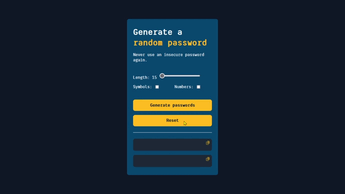

# Password Generator - Solo Project



## *Goals* 🎯

🔳 Build it from "scratch".

🔳 Generate two random password when the user clicks the button.

🔳 Each password should be 15 characteres long.

### *Stretch goals* 💪

🔳 Ability to set password length.

🔳 Add "copy on click"

🔳 Toggle "symbols" and "numbers" on/off.

## *Screenshot* 📸


## *Links* 🔗

[Live Site URL](https://mendezpvi.github.io/fcp-password-generator/) 👀

## *What I learnt* 🤓

`navigator.clipboard.writeText()` - writes the specified text to the system clipboard.
```js
navigator.clipboard.writeText(passwordOneValue)
```

`spread operator ...` - allows an iterable, such as an array or string, to be expanded in places where zero or more arguments or elements are expected.
```js
let newCharacteres = [...characters]
newCharacteres.push(...numbers)
```

`join()` - joins all the elements of an array into a string and returns this string.
```js
passwordOne.textContent = resultOne.join("")
```